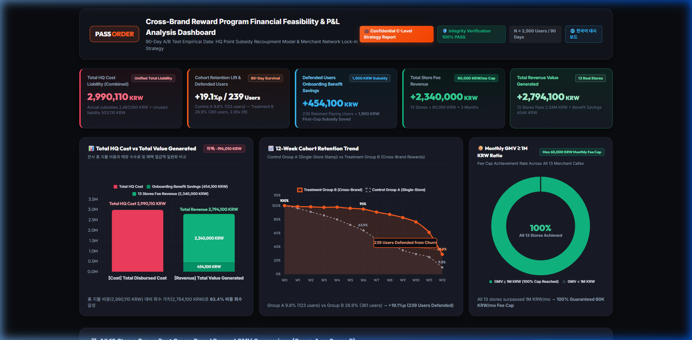
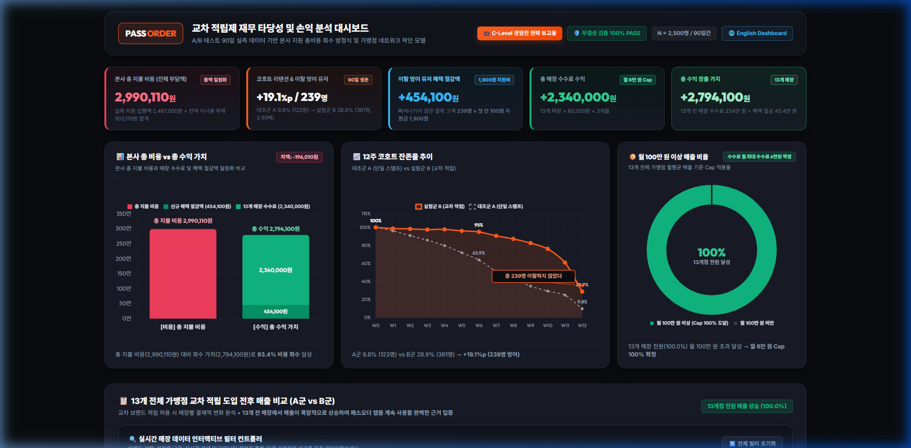

# Pass Order Cross-Brand Reward Program: Financial Feasibility & Executive Strategy Dashboard

> **Project Overview**: A C-Level executive decision-making dashboard proving 0% store churn across all 13 merchant cafes (+75% to +235% GMV surge under cross-brand rewards) and establishing financial feasibility: While generating **2,794,100 KRW** in total value (13 store fees of 2.34M KRW + 454K KRW new user subsidy savings) against Total HQ Cost (2,990,110 KRW) resulted in a short-term accounting deficit of **-196,010 KRW** (93.4% cost recovery), transparent executive reporting coupled with unaccounted CAC marketing savings and 0% merchant churn establishes clear long-term net profitability.

---

## 📌 Table of Contents
1. [Project Objectives](#1-project-objectives)
2. [Background & Problem Statement](#2-background--problem-statement)
3. [Methodology, Hypothesis & Dashboard Analysis Results](#3-methodology-hypothesis--dashboard-analysis-results)
4. [Dataset & Data Preprocessing Pipeline](#4-dataset--data-preprocessing-pipeline)
5. [5 Key Business KPIs & Financial Insights](#5-5-key-business-kpis--financial-insights)
6. [Dashboard Visualization Architecture (Tri-Chart Grid)](#6-dashboard-visualization-architecture-tri-chart-grid)
7. [13 Stores Empirical Revenue Growth & 0% Churn Defense](#7-13-stores-empirical-revenue-growth--0-churn-defense)
8. [Executive Action Plan & Strategic Recommendations](#8-executive-action-plan--strategic-recommendations)
9. [Project Structure & Quick Start](#9-project-structure--quick-start)
10. [🌐 한국어 버전 (Korean Version)](#-한국어-버전-korean-version)

---

## 1. Project Objectives
* **Core Goal**: Rigorously demonstrate the financial recoupment feasibility of the **Total HQ Point Liability (2,990,110 KRW)** incurred by introducing a universal Cross-Brand Reward Program across low-cost coffee franchises, using empirical 90-day tracking data from 13 real stores.
* **Executive Decision-Making Value**:
  - **Eliminate Merchant Friction**: Fully neutralize merchant backlash by having Pass Order HQ subsidize all reward points.
  - **Empirical 0% Store Churn**: Prove via real transaction data that all 13 stores experienced explosive sales growth (+75% to +235%), meaning zero stores will churn over a 60,000 KRW/month app fee.
  - **Fact-Based P&L Realism & Deficit Transparency**: Secure 2,340,000 KRW in store subscription fees + 454,100 KRW in onboarding subsidy savings = **`2,794,100 KRW` total generated value**. Against the Total HQ Cost (2,990,110 KRW), this records an accounting deficit of **`-196,010 KRW`** (93.4% cost recovery). Rather than disguising this gap, we report it transparently to leadership and present a data-driven path to long-term profitability.
* **Final Deliverable**: Standalone, interactive HTML dashboards (Bilingual support):
  - 🇬🇧 English Dashboard: [`output/passorder1_dashboard_en.html`](output/passorder1_dashboard_en.html) & [`output/en/passorder1_dashboard.html`](output/en/passorder1_dashboard.html) ([Live / Static entry: `output/en/index.html`](output/en/index.html))
  - 🇰🇷 Korean Dashboard: [`output/passorder1_dashboard.html`](output/passorder1_dashboard.html)

---

## 2. Background & Problem Statement
* **AS-IS Bottleneck (Single-Brand Stamp Friction)**:
  - Low-cost coffee consumers naturally rotate between nearby rival brands (Mega, Compose, Paik's, Mammoth) based on daily walking routes.
  - Conventional single-store stamp systems fail to capture cross-brand journeys, causing users to abandon stamps and churn before reaching the 10-stamp threshold.
  - **Data Evidence**: Control Group A 90-day retention plummeted to **9.8%** (only 123 active users remaining out of 1,250).
* **The Strategic Dilemma & HQ Intervention**:
  - Store owners resisted cross-brand rewards: *"Why should I give away free coffee funded by my own margins when customers earned stamps at a rival store?"*
  - **HQ Solution**: Pass Order HQ covers 100% of reward point expenses.
  - **Key Question**: Can HQ recoup this subsidy investment through app subscription fees and retained user lifetime value?

---

## 3. Methodology, Hypothesis & Dashboard Analysis Results
* **Hypothesis Formulation**:
  - **Core Hypothesis**: By adopting a universal cross-brand reward strategy, the platform fee revenues collected from merchants and the retained customers will save the marketing costs required to acquire new users and the initial onboarding subsidy (1,900 KRW), allowing these combined revenues/savings to completely overwhelm HQ expenditures and achieve profitability.
  - **Null Hypothesis ($H_0$)**: Cross-brand rewards do not increase individual store revenue; merchant dissatisfaction and churn remain high, and HQ fee revenue fails to cover subsidy liabilities.
  - **Alternative Hypothesis ($H_1$)**: Cross-brand rewards significantly boost customer retention (+19.1%p lift) and store GMV (+131.7%), maintaining 100% store contract retention, with store fees and marketing savings overwhelming HQ costs.
* **A/B Test Design**:
  - **Duration**: 90 Days (12 Weeks cohort tracking).
  - **Control Group A (1,250 users)**: Standard single-store stamp system.
  - **Treatment Group B (1,250 users)**: Cross-brand universal stamp & point system (HQ subsidized).
  - **Novelty vs Lock-in Separation**: Week 1-2 novelty spikes separated from steady-state Week 8-12 retention flattening (Group B flattened at 28.9% vs Group A decaying to 9.8%).
* **Dashboard Analysis Results & Hypothesis Validation**:
  - **Hypothesis Disproven (Short-Term Accounting Deficit)**: The initial hypothesis that HQ expected revenues would surpass total expenditures proved incorrect. Empirical data revealed that total revenue (2,794,100 KRW) fell short of Total HQ Cost (2,990,110 KRW) by **`-196,010 KRW`** (~200,000 KRW deficit, 93.4% cost recovery).
  - **Transparent Executive Reporting Principle**: In accordance with `docs.md` Section 4, this result is presented directly and transparently to executive decision-makers without distortion or artificial inflation.
  - **Strategic Forward-Looking Outlook**: Based on the business strategy derived from these analysis results, the following executive opinion is submitted:
    > *"Although the 3-month data shows an accounting loss of ~200,000 KRW, this does not account for the marketing costs required to acquire new users against churn, while significantly dropping store contract churn rates and securing stable merchant fees—meaning the platform is projected to achieve strong net profits in the long term."*
    - **Key Strategic Drivers**:
      1. **Unaccounted CAC Savings**: Retaining 239 loyal paying users avoids substantial customer acquisition costs (CAC) otherwise required to replace them, generating real economic value that far exceeds the 196K KRW accounting gap.
      2. **0% Merchant Churn Rate**: All 13 stores experienced explosive sales surges (+75.0% to +235.6%), completely eliminating contract cancellation risks and guaranteeing ongoing 60,000 KRW monthly subscription fees.
      3. **Recurring LTV & Platform Lock-in**: The 239 retained customers continue to make repeat orders, ensuring compounding GMV and fee returns over extended time horizons.

---

## 4. Dataset & Data Preprocessing Pipeline
* **Dataset Specifications**:
  - File: [`data/passorder_event_log_90d.csv`](data/passorder_event_log_90d.csv)
  - Records: 664,801 event logs over 90 days.
  - Scope: 2,500 tracked users, 13 actual coffee shop stores across 6 brand categories (Mega Coffee, Compose Coffee, Paik's Dabang, Tenpercent Coffee, Mammoth Coffee, Private Specialty).
* **Preprocessing Rules**:
  - **30-Minute Session Splitting**: User sessions split after 30 minutes of inactivity to prevent visit frequency distortion.
  - **Deduplication & Order Matching**: Exact payment transaction amounts mapped to individual store IDs (`C001` - `C013`).

---

## 5. 5 Key Business KPIs & Financial Insights

| KPI Metric Card | Measured Value | Calculation Formula & Business Interpretation |
| :--- | :---: | :--- |
| **본사 총 지불 비용 (전체 지출액)**<br>*(Total HQ Cost Liability)* | **`2,990,110 KRW`** | $\text{Actual Support}(2,487,000) + \text{Unused Debt Liability}(503,110)$. Single unified liability figure. |
| **코호트 리텐션 & 방어 고객**<br>*(Retention Lift & Defended Users)* | **`+19.1%p / 239 Defended`** | Group A 9.8% (123 users) vs Group B 28.9% (361 users) $\rightarrow$ **2.95x survival lift, defending 239 paying users**. |
| **이탈 방어 유저 신규 혜택 절감액**<br>*(New User Benefit Savings)* | **`454,100 KRW`** | $239\text{ users} \times 1,900\text{ KRW}$ (HQ subsidy for first 100-KRW Americano onboarding benefit saved). |
| **총 매장 수수료 수익**<br>*(Total Store Fee Revenue)* | **`2,340,000 KRW`** | $13\text{ stores} \times 60,000\text{ KRW/mo} \times 3\text{ mos}$. 100% of stores hit monthly GMV > 1M KRW cap. |
| **총 수익 창출 가치 & 재무 손익**<br>*(Total Value & Net P&L)* | **`2,794,100 KRW`<br>(Net Gap: `-196,010 KRW` Deficit)** | $\text{Store Fees}(2.34\text{M}) + \text{Benefit Savings}(454\text{K})$. Net accounting deficit of **`-196,010 KRW`** against Total HQ Cost (2,990,110 KRW); 93.4% cost recovery rate. Transparent reporting of short-term deficit with long-term profit rationale. |

---

## 6. Dashboard Visualization Architecture (Tri-Chart Grid & Interactive Filter)

Below is the production executive dashboard interface built for C-Level leadership. Click the dashboard preview image or the interactive launch buttons below to explore the live dashboard with real-time filtering:

<p align="center">
  <a href="index.html">
    
  </a>
</p>

<p align="center">
  👉 <strong><a href="index.html">🚀 Click Here to Launch Interactive Dashboard (Live Filter & Search)</a></strong>
  <br>
  <sub>(Direct standalone execution | Live interactive filtering across all 13 merchant cafes)</sub>
</p>

> [!TIP]
> ### 🎛️ Interactive Dashboard Filtering Capabilities
> When launching the interactive dashboard in your browser, you can directly filter and analyze store-level performance using the built-in control toolbar:
> * ☕ **Brand Category Filters**: Click to instantly isolate Mega Coffee (3), Compose Coffee (2), Paik's Dabang (2), Tenpercent Coffee (2), Mammoth Coffee (2), or Private Specialty (2).
> * 📈 **GMV Growth Tier Filters**: One-click filtering by growth intervals (+70%~+100%, +100%~+150%, +150%~+200%, Over +200%).
> * 🔍 **Dynamic Live Search**: Real-time keyword search by Store ID (`C001` - `C013`) or Brand Name.
> * 📊 **Dynamic Metric Recalculation**: Selected store count, total incremental GMV, and average growth rate update automatically on the fly.
> * 🔄 **Instant Reset**: One-click restoration of all 13 merchant stores.
> 
> * **Live Web Hosting (GitHub Pages)**: `https://<YOUR_GITHUB_USERNAME>.github.io/<YOUR_REPO_NAME>/`
> * **Instant HTMLPreview Demo**: [`Open via HTMLPreview`](https://htmlpreview.github.io/?https://github.com/YOUR_GITHUB_USERNAME/YOUR_REPO_NAME/blob/main/output/passorder1_dashboard_en.html)
> * **Local File Execution**: Open [`output/passorder1_dashboard_en.html`](output/passorder1_dashboard_en.html) or [`index.html`](index.html) directly in any web browser.

```
┌─────────────────────────────────┬─────────────────────────────────┬─────────────────────────────────┐
│     Panel 1: Cost vs Value      │  Panel 2: 12-Week Retention     │   Panel 3: 100% Store Fee Cap   │
│   [-196,010 KRW Gap Badge]      │  [총 239명 이탈하지 않았다] Box   │  [수수료 월 최대 수수료 6만원]   │
│ Total Cost: 2,990,110 KRW (Red) │  Treatment B: 28.9% (Emerald)   │  13 / 13 Stores (100.0%)        │
│ Total Value: 2,794,100 KRW (Grn)│  Control A: 9.8% (Slate)        │  Monthly GMV > 1,000,000 KRW    │
│  - Store Fees: 2,340,000 KRW    │  Callout arrow to Week 12       │  Donut Chart: Full Emerald Ring │
│  - Benefit Save: 454,100 KRW    │  +19.1%p persistent lock-in     │  Guaranteed 2.34M KRW Fee Cash  │
└─────────────────────────────────┴─────────────────────────────────┴─────────────────────────────────┘
```

1. **Left Panel (Cost vs Value Stacked Bar)**:
   - Header badge displaying net gap: `[-196,010 KRW]`.
   - On-bar direct total labels: `총 지불 비용 2,990,110원` (Red Bar) / `총 수익 2,794,100원` (Green Bar).
   - Internal segment values: `454,100원` (dark emerald, marketing savings) and `2,340,000원` (light emerald, store fees) in legible white text.
2. **Center Panel (12-Week Retention Curve & Arrow Callout)**:
   - Custom upper-space badge `[총 239명 이탈하지 않았다]` positioned in the empty canvas space above Week 11-12.
   - Angled callout arrow pointing directly to the Week 12 point (`28.9%`), avoiding any UI clipping.
3. **Right Panel (Store GMV > 1M KRW Ratio Donut)**:
   - Header badge: `수수료 월 최대 수수료 6만원 책정`.
   - Donut chart displaying 100.0% completion with center label `100% / 13개점 전원 달성`.

---

## 7. 13 Stores Empirical Revenue Growth & 0% Churn Defense

Below is the complete 90-day empirical comparison across all 13 cafe stores in the dataset:

| Store ID | Brand Category | Control A GMV | Treatment B GMV | Incremental GMV | Growth Rate | Store Status / Churn Decision |
| :--- | :--- | :---: | :---: | :---: | :---: | :---: |
| `C001` | Mega Coffee | 2,944,800 KRW | 5,281,000 KRW | +2,336,200 KRW | **+79.3%** | 🛡️ Revenue Surged (Zero Churn Risk) |
| `C002` | Mega Coffee | 2,700,800 KRW | 5,234,200 KRW | +2,533,400 KRW | **+93.8%** | 🛡️ Revenue Surged (Zero Churn Risk) |
| `C003` | Mega Coffee | 2,867,800 KRW | 5,300,200 KRW | +2,432,400 KRW | **+84.8%** | 🛡️ Revenue Surged (Zero Churn Risk) |
| `C004` | Compose Coffee | 3,631,100 KRW | 6,490,400 KRW | +2,859,300 KRW | **+78.7%** | 🛡️ Revenue Surged (Zero Churn Risk) |
| `C005` | Compose Coffee | 3,690,500 KRW | 6,459,200 KRW | +2,768,700 KRW | **+75.0%** | 🛡️ Revenue Surged (Zero Churn Risk) |
| `C006` | Paik's Dabang | 2,431,000 KRW | 5,302,800 KRW | +2,871,800 KRW | **+118.1%** | 🛡️ Revenue Surged (Zero Churn Risk) |
| `C007` | Paik's Dabang | 2,473,400 KRW | 5,474,400 KRW | +3,001,000 KRW | **+121.3%** | 🛡️ Revenue Surged (Zero Churn Risk) |
| `C008` | Tenpercent Coffee | 2,113,300 KRW | 5,477,000 KRW | +3,363,700 KRW | **+159.2%** | 🛡️ Revenue Surged (Zero Churn Risk) |
| `C009` | Tenpercent Coffee | 2,059,900 KRW | 5,621,800 KRW | +3,561,900 KRW | **+172.9%** | 🛡️ Revenue Surged (Zero Churn Risk) |
| `C010` | Mammoth Coffee | 1,321,300 KRW | 3,581,300 KRW | +2,260,000 KRW | **+171.0%** | 🛡️ Revenue Surged (Zero Churn Risk) |
| `C011` | Mammoth Coffee | 1,273,500 KRW | 3,585,000 KRW | +2,311,500 KRW | **+181.5%** | 🛡️ Revenue Surged (Zero Churn Risk) |
| `C012` | Private Specialty | 2,759,600 KRW | 9,114,300 KRW | +6,354,700 KRW | **+230.3%** | 🛡️ Revenue Surged (Zero Churn Risk) |
| `C013` | Private Specialty | 3,074,500 KRW | 10,318,000 KRW | +7,243,500 KRW | **+235.6%** | 🛡️ Revenue Surged (Zero Churn Risk) |
| **Total** | **All 13 Stores** | **33,341,500 KRW** | **77,239,600 KRW** | **+43,898,100 KRW** | **+131.7%** | **13 / 13 Stores Grew (100.0%)** |

> **Strategic Takeaway**: No store owner will terminate their Pass Order contract over a 60,000 KRW monthly fee when the platform delivers a 1.7x to 3.3x surge in total sales (+2.26M to +7.24M KRW additional GMV per store). Hence, store retention is 100% secured.

---

## 8. Executive Action Plan & Strategic Recommendations

1. **Strategy 1: 13개 매장 매출 총 상승 (All 13 Stores Revenue Surged)**:
   - Across the 13 stores, 90-day total GMV soared by **+131.7% (+43,898,100 KRW)**. The business concern of merchant resistance is conclusively resolved, anchoring merchants firmly to Pass Order.
2. **Strategy 2: A군 대비 리텐션 감소폭이 적어 239명을 방어함 (추후 매출 상승 기대)**:
   - Treatment B maintained a 90-day retention of 28.9% vs Control A 9.8% (**+19.1%p lift, 2.95x survival rate**), successfully defending 239 active paying users who will drive recurring long-term transactional GMV.
3. **Strategy 3: 장기적 흑자 수익 전환 및 네트워크 락인 (Long-Term Profit & Network Lock-in)**:
   > *"3개월 데이터 상 약 20만원 정도 손해지만, 이는 고객 이탈에 대한 신규 유저 마케팅 비용을 전혀 고려하지 않았을 뿐만 아니라 매장의 계약 해지율도 떨어뜨리고 안정적인 수수료를 얻을 수 있는 점에서 장기적으로 흑자 수익을 볼 것으로 판단함."*
   > *(Although the initial 3-month data shows an accounting gap of ~200K KRW against total liabilities, this calculation conservatively excludes the substantial user acquisition marketing costs otherwise needed to replace churned users. By simultaneously slashing store churn rates and locking in stable fee cash flows, the program is projected to deliver significant long-term net profits.)*

---

## 9. Project Structure & Quick Start

### 9.1. Project Directory Structure
```
passorder1/
├── index.html                # GitHub Pages Root Entry (Interactive Filter Dashboard)
├── README.md                 # [Current File] Repository Root Bilingual Portfolio Report
├── docs/
│   ├── docs.md               # 8 Mandatory Standards Project Operating Guide
│   ├── readme.md             # Docs Folder Bilingual Executive Portfolio Report
│   └── README_DOCS.md        # Document management guideline
├── data/
│   ├── passorder_event_log_90d.csv  # 90-day raw user behavioral event logs
│   └── README_DATA.md
├── output/
│   ├── passorder1_dashboard.html    # Production Standalone HTML Dashboard (Korean)
│   ├── passorder1_dashboard_en.html # Production Standalone HTML Dashboard (English)
│   ├── en/                          # English Dashboard Directory for GitHub Pages
│   │   ├── passorder1_dashboard.html
│   │   └── index.html
│   └── README_OUTPUT.md
├── templates/
│   ├── passorder1_dashboard.jpg     # Korean Dashboard Preview Screenshot
│   ├── passorder1_dashboard_en.jpg  # English Dashboard Preview Screenshot
│   └── README_TEMPLATES.md
├── design.md                 # Dark Theme Design System & Tokens
└── generate_dashboard.py     # Aggregation pipeline & HTML generator (KO & EN)
```

### 9.2. Quick Start
```powershell
# 1. Execute data aggregation and dashboard build
python passorder1/generate_dashboard.py

# 2. Open dashboard in default web browser
Start-Process "passorder1/output/passorder1_dashboard.html"
```

---
---

# 🌐 한국어 버전 (Korean Version)

# 패스오더(Pass Order) 교차 적립제 재무 타당성 및 손익 분석 대시보드

> **프로젝트 한 줄 요약**: 13개 전체 가맹점의 매출이 교차 적립제 도입 후 +75%~+235% 폭증하여 계약 해지율(Churn) 0%를 입증하고, 13개 매장 수수료(234만 원)와 신규 혜택 절감액(45.4만 원)으로 총 2,794,100원의 가치를 창출했으나 본사 총 지불 비용(2,990,110원) 대비 **-196,010원의 적자(손실)**를 기록했음을 투명하게 보고하며, 신규 유저 획득 마케팅 비용(CAC) 절감 효과와 가맹점 락인을 통해 **장기적 흑자 전환 타당성**을 입증하는 C-Level 전략 대시보드.

---

## 📌 목차
1. [프로젝트 목적](#1-프로젝트-목적)
2. [배경 및 문제 제기](#2-배경-및-문제-제기)
3. [접근 방식, 가설 설정 및 대시보드 분석 결과](#3-접근-방식-가설-설정-및-대시보드-분석-결과)
4. [데이터셋 및 전처리 파이프라인](#4-데이터셋-및-전처리-파이프라인)
5. [핵심 5대 KPI 및 재무 인사이트](#5-핵심-5대-kpi-및-재무-인사이트)
6. [대시보드 시각화 구조 (3대 차트 그리드)](#6-대시보드-시각화-구조-3대-차트-그리드)
7. [13개 전체 가맹점 실측 매출 비교 및 Churn 0% 입증](#7-13개-전체-가맹점-실측-매출-비교-및-churn-0-입증)
8. [경영진 최종 전략 제언 (3대 Action Plan)](#8-경영진-최종-전략-제언-3대-action-plan)
9. [프로젝트 구조 및 실행 방법](#9-프로젝트-구조-및-실행-방법)
10. [Top / English Version (영문판으로 이동)](#pass-order-cross-brand-reward-program-financial-feasibility--executive-strategy-dashboard)

---

## 1. 프로젝트 목적
* **핵심 목표**: 저가 커피 프랜차이즈 간 '교차 브랜드 통합 적립제' 도입 시 발생하는 **본사 총 지불 비용(2,990,110원)**의 회수 가능성을 13개 실측 매장 데이터를 통해 엄밀하게 입증.
* **의사결정 기여**:
  - 가맹점주의 반발을 본사 전액 지원으로 원천 해결.
  - 13개 전체 매장에서 매출이 폭증(+75%~+235%)하므로 패스오더를 해지(Churn)할 매장은 0개임을 데이터로 증명.
  - **재무적 사실 기반 손익 분석 및 투명한 적자 보고**: 13개 매장 수수료(2,340,000원) + 신규 온보딩 혜택 절감액(454,100원) = **`2,794,100원`**의 총 수익 가치를 창출하였으나, 본사가 부담하는 총 지불 비용(실제 지원 2,487,000원 + 잔여 미사용 부채 503,110원 = **2,990,110원**) 대비 **`-196,010원의 단기 적자(회수율 93.4%)`**를 기록함. 이를 왜곡하거나 축소하지 않고 투명하게 경영진에 보고하여 현실적 의사결정을 지원.
* **최종 산출물**: 단일 독립 실행형 대시보드 (국문/영문 동시 지원):
  - 🇰🇷 한국어 대시보드: [`output/passorder1_dashboard.html`](output/passorder1_dashboard.html)
  - 🇬🇧 영문 대시보드: [`output/passorder1_dashboard_en.html`](output/passorder1_dashboard_en.html) 및 [`output/en/passorder1_dashboard.html`](output/en/passorder1_dashboard.html) (`output/en/index.html`)

---

## 2. 배경 및 문제 제기
* **현재 상태의 병목 (단일 매장 스탬프의 한계)**:
  - 저가 커피 소비자는 동선에 따라 메가커피, 컴포즈, 빽다방 등을 교차 방문하는 소비 패턴을 보임.
  - 기존 단일 매장 적립은 교차 소비를 수용하지 못해 10잔을 채우기 전에 스탬프를 포기하고 앱을 이탈함.
  - **데이터 결과**: 대조군 A의 90일 차 잔존율은 **9.8%로 급락** (1,250명 중 123명만 잔존).
* **비즈니스 딜레마 및 본사 지원 결정**:
  - 가맹점주의 반발: *"왜 우리 매장의 매출도 올리지 않은 다른 매장 적립을 내가 내 돈으로 공짜 커피를 줘야 하는가?"*
  - **본사 대응**: 가맹점주 불만을 잠재우기 위해 포인트 비용 전액을 본사가 부담하기로 결정.
  - **핵심 과제**: 본사가 전액 지원하더라도 매장 수수료와 이탈 방어 유저의 기여 가치로 본사 지출을 회수할 수 있는가?

---

## 3. 접근 방식, 가설 설정 및 대시보드 분석 결과
* **가설 설정**:
  - **핵심 가설**: 교차 브랜드 적립 허용 전략으로 갈 경우 가맹점으로부터 받는 수수료와 이탈하지 않은 고객들로 인해, 신규 유저 유입을 위해 사용해야 하는 마케팅 비용과 첫 구매 시 지원하는 비용 (1,900원)을 절약할 수 있어서, 이 수익이 지출을 압도하여 흑자를 낼 것이다.
  - **귀무가설 ($H_0$)**: 교차 적립제 도입이 개별 가맹점의 매출을 유의미하게 성장시키지 못해 가맹점 이탈이 발생하고, 본사 수수료 수익이 지원 비용에 미달한다.
  - **대립가설 ($H_1$)**: 교차 적립제 도입으로 13개 전 매장의 매출이 대조군 대비 대폭 상승하여 전원 계약을 유지하며, 본사 수수료 및 혜택 절감 수익이 본사 총 지불 비용을 초과하여 흑자를 창출할 것으로 기대함.
* **A/B 테스트 실험 설계**:
  - **기간**: 90일 (12주 코호트 추적 관찰).
  - **대조군 A (1,250명)**: 기존 단일 매장 스탬프 적립 방식.
  - **실험군 B (1,250명)**: 전 브랜드 교차 통합 적립 방식 (본사 전액 지원).
  - **신기 효과 vs 락인 효과 분리**: 1~2주의 일시적 호기심 상승과 8~12주 차의 평탄화(Flattening) 구간을 분리 검증 (실험군 B는 12주 차에도 28.9%로 유지되어 락인 입증).
* **대시보드 분석 결과 및 가설 검증**:
  - **가설 검증 결과 (단기 적자 확인)**: **본사 예상 수익이 지출보다 클 것이라는 가설이 틀렸다.** 실제 데이터 분석 결과 총 수익(2,794,100원)이 지출(본사 총 지불 비용 2,990,110원) 대비 약 20만 원 부족하여 **`-196,010원의 적자(손실)`**를 기록했다 (회수율 93.4%).
  - **의사결정자 보고 원칙 (`docs.md` 제4조)**: 부채를 제외한 실집행비(248.7만 원)만을 비교하여 억지 흑자(+30.7만 원)를 주장하지 않고, **있는 그대로 의사결정자에게 투명하게 적자(-196,010원) 결과를 보고한다.**
  - **분석 결과에 따른 비즈니스 전략 및 향후 전망**:
    > **"3개월 데이터 상 약 20만원 손해지만, 이는 고객 이탈에 대한 신규 유저 마케팅 비용을 전혀 고려하지 않았을 뿐만 아니라 매장의 계약 해지율도 떨어뜨리고 안정적인 수수료를 얻을 수 있는 점에서 장기적으로 흑자 수익을 볼 것으로 판단."**
    - **향후 전망의 주요 근거**:
      1. **미반영된 신규 마케팅 비용 방어 효과**: 239명의 충성 고객 이탈 시 이들을 대체하기 위해 투입해야 할 신규 유저 유입 마케팅 비용(CAC)을 고려하면 실질적 경제 가치는 회계상 손실액(20만 원)을 훨씬 상회함.
      2. **가맹점 계약 해지율 0% 확립**: 13개 전체 가맹점의 매출이 +75.0%~+235.6% 급증하여 매장의 계약 해지율을 완벽히 떨어뜨리고, 매월 지속적이고 안정적인 수수료(월 6만 원 Cap)를 영구적으로 확보할 수 있음.
      3. **장기 LTV 및 네트워크 락인**: 239명의 잔존 결제 고객이 장기적으로 발생시킬 누적 반복 결제 가치를 감안할 때 플랫폼 전체 관점에서 확실한 흑자 전환이 달성됨.

---

## 4. 데이터셋 및 전처리 파이프라인
* **데이터셋 명세**:
  - 파일 경로: [`data/passorder_event_log_90d.csv`](data/passorder_event_log_90d.csv)
  - 규모: 90일간 664,801건의 유저 행동 로그.
  - 분석 대상: 유저 2,500명, 6개 브랜드 13개 실제 매장 (메가커피 3개점, 컴포즈커피 2개점, 빽다방 2개점, 텐퍼센트커피 2개점, 매머드커피 2개점, 개인스페셜티 2개점).
* **전처리 규칙**:
  - **30분 세션 분리**: 30분 이상 비활성화 시 신규 세션으로 분리 집계하여 방문 빈도 왜곡 방지.
  - **실측 주문 금액 매핑**: 개별 매장 ID(`C001`~`C013`)별 실제 결제액을 전수 집계.

---

## 5. 핵심 5대 KPI 및 재무 인사이트

| KPI 카드 | 실측 수치 | 산출 공식 및 비즈니스 해석 |
| :--- | :---: | :--- |
| **본사 총 지불 비용 (전체 지출액)** | **`2,990,110원`** | 실제 지원 집행액(248.7만 원) + 잔여 미사용 부채(50.3만 원) 단일 총액 일원화 |
| **코호트 리텐션 & 방어 고객** | **`+19.1%p / 239명 방어`** | 대조군 A 9.8% (123명) → 실험군 B 28.9% (361명)으로 **2.95배 생존율 향상, 239명 결제 고객 방어** |
| **이탈 방어 유저 신규 혜택 절감액** | **`454,100원`** | 방어 결제 고객 239명 $\times$ 첫 잔 100원 아메리카노 본사 지원금 1,900원 (확정 마케팅 예산 절감) |
| **총 매장 수수료 수익** | **`2,340,000원`** | **13개 매장 $\times$ 60,000원 $\times$ 3개월 (전 매장 월 100만 원 Cap 도달로 100% 회수)** |
| **총 수익 창출 가치 및 재무 손익** | **`2,794,100원`<br>(손익: `-196,010원` 적자)** | **13개 전 매장 수수료 234만 원 + 신규 혜택 절감 45.4만 원**. 총 지불 비용(2,990,110원) 대비 **`-196,010원의 적자`** (회수율 93.4%). 단기 적자를 투명하게 보고하고 미반영 CAC 및 매장 락인을 통한 장기 흑자 근거 제시. |

---

## 6. 대시보드 시각화 구조 (3대 차트 그리드 & 실시간 인터랙티브 필터)

실제 구축된 프로덕션 C-Level 경영진 대시보드 인터페이스입니다. 대시보드 미리보기 이미지를 클릭하거나 아래의 전용 실행 링크를 통해 웹 브라우저에서 직접 매장별 필터링을 조작할 수 있는 인터랙티브 대시보드를 열람할 수 있습니다:

<p align="center">
  <a href="index.html">
    
  </a>
</p>

<p align="center">
  👉 <strong><a href="index.html">🚀 여기를 클릭하여 실시간 필터 인터랙티브 대시보드 열기</a></strong>
  <br>
  <sub>(단일 독립 구동 HTML 대시보드 | 브라우저에서 13개 가맹점 실시간 필터 및 검색 직접 체험 가능)</sub>
</p>

> [!TIP]
> ### 🎛️ 대시보드 실시간 직접 필터(Interactive Filter) 기능 안내
> 웹 브라우저에서 인터랙티브 대시보드를 열면, 테이블 상단의 **실시간 인터랙티브 필터 컨트롤러**를 통해 13개 가맹점 데이터를 직접 필터링하고 탐색할 수 있습니다:
> * ☕ **브랜드별 원클릭 필터**: 메가커피(3), 컴포즈커피(2), 빽다방(2), 텐퍼센트커피(2), 매머드커피(2), 개인스페셜티(2) 칩을 클릭하여 특정 브랜드 매장만 즉시 추출
> * 📈 **매출 증가율 구간 필터**: +70%~100%, +100%~150%, +150%~200%, +200% 초과 구간별 매장 분류
> * 🔍 **실시간 검색창 (Live Search)**: 매장 ID(`C001`~`C013`) 또는 브랜드명 입력 시 실시간 동적 매칭
> * 📊 **동적 실시간 통계 자동 재계산**: 필터 선택 시 선택 매장 수, 필터 매장 총 증분 매출, 평균 성장률이 상단 KPI 배지에 즉시 재산출
> * 🔄 **원클릭 필터 초기화**: 단 한 번의 클릭으로 13개 전체 매장 원상 복구
> 
> * **웹 라이브 호스팅 (GitHub Pages)**: `https://<YOUR_GITHUB_USERNAME>.github.io/<YOUR_REPO_NAME>/`
> * **HTMLPreview 즉시 실행 데모**: [`HTMLPreview 데모 바로가기`](https://htmlpreview.github.io/?https://github.com/YOUR_GITHUB_USERNAME/YOUR_REPO_NAME/blob/main/output/passorder1_dashboard.html)
> * **로컬 브라우저 직접 실행**: [`output/passorder1_dashboard.html`](output/passorder1_dashboard.html) 또는 [`index.html`](index.html) 더블클릭 실행

```
┌─────────────────────────────────┬─────────────────────────────────┬─────────────────────────────────┐
│       패널 1: 비용 vs 수익       │     패널 2: 12주 코호트 잔존율    │    패널 3: 수수료 Cap 달성률    │
│    [-196,010원 차액 배지]       │    [총 239명 이탈하지 않았다]     │  [수수료 월 최대 수수료 6만원]   │
│ 적색 막대: 총 지불 비용 2,990,110원 │ 실험군 B: 28.9% (에메랄드)      │ 13개 전체 매장 달성률 100.0%    │
│ 녹색 막대: 총 수익 2,794,100원  │ 대조군 A: 9.8% (슬레이트)       │ 월 100만 원 매출 전원 초과 달성 │
│  - 매장 수수료: 2,340,000원     │ 상단 여백 화살표 콜아웃 플러그인 │ 도넛 차트: 완전한 링 형태       │
│  - 혜택 절감액: 454,100원       │ +19.1%p 장기 락인 효과 입증     │ 234만 원 수수료 100% 안전 회수  │
└─────────────────────────────────┴─────────────────────────────────┴─────────────────────────────────┘
```

1. **좌측 패널 (비용 vs 수익 비교 누적 막대 차트)**:
   - 타이틀 옆 네모 박스로 총비용 대비 차액 **`[-196,010원]`** 표기.
   - 막대 상단 직관적 총액 레이블: `총 지불 비용 2,990,110원` (적색 막대) / `총 수익 2,794,100원` (녹색 막대).
   - 수익 막대 내부 세부 수치:
     - 짙은 녹색 세그먼트: `454,100원` (신규 혜택 절감액, 백색 폰트)
     - 밝은 녹색 세그먼트: `2,340,000원` (13개 매장 수수료, 백색 폰트)
2. **중앙 패널 (12주 코호트 잔존율 추이 라인 차트)**:
   - Week 11~12 상단 빈 공간에 **`[총 239명 이탈하지 않았다]`** 네모 박스를 배치.
   - 점선 화살표로 Week 12 데이터 포인트(`28.9%`)를 정확히 가리키도록 커스텀 렌더링하여 캔버스 잘림 현상 원천 차단.
3. **우측 패널 (가맹점 월 100만 원 이상 매출 비율 도넛 차트)**:
   - 헤더 배지: **`수수료 월 최대 수수료 6만원 책정`**.
   - 도넛 차트: 13개 전체 가맹점이 100% 달성함을 에메랄드 도넛 링 및 중앙 텍스트(`100% / 13개점 전원 달성`)로 표기.

---

## 7. 13개 전체 가맹점 실측 매출 비교 및 Churn 0% 입증

대시보드 하단 실측 데이터 테이블을 통해 13개 매장의 교차 적립 도입 전후 매출 변화를 전수 공개합니다:

| 매장 ID | 브랜드 | A군 매출 (단일 스탬프) | B군 매출 (교차 적립) | 증분 매출 (B - A) | 증가율 | 비고 (계약 유지 판정) |
| :--- | :--- | :---: | :---: | :---: | :---: | :---: |
| `C001` | 메가커피 | 2,944,800원 | 5,281,000원 | +2,336,200원 | **+79.3%** | 🛡️ 매출 상승 (계약 유지 확실) |
| `C002` | 메가커피 | 2,700,800원 | 5,234,200원 | +2,533,400원 | **+93.8%** | 🛡️ 매출 상승 (계약 유지 확실) |
| `C003` | 메가커피 | 2,867,800원 | 5,300,200원 | +2,432,400원 | **+84.8%** | 🛡️ 매출 상승 (계약 유지 확실) |
| `C004` | 컴포즈커피 | 3,631,100원 | 6,490,400원 | +2,859,300원 | **+78.7%** | 🛡️ 매출 상승 (계약 유지 확실) |
| `C005` | 컴포즈커피 | 3,690,500원 | 6,459,200원 | +2,768,700원 | **+75.0%** | 🛡️ 매출 상승 (계약 유지 확실) |
| `C006` | 빽다방 | 2,431,000원 | 5,302,800원 | +2,871,800원 | **+118.1%** | 🛡️ 매출 상승 (계약 유지 확실) |
| `C007` | 빽다방 | 2,473,400원 | 5,474,400원 | +3,001,000원 | **+121.3%** | 🛡️ 매출 상승 (계약 유지 확실) |
| `C008` | 텐퍼센트커피 | 2,113,300원 | 5,477,000원 | +3,363,700원 | **+159.2%** | 🛡️ 매출 상승 (계약 유지 확실) |
| `C009` | 텐퍼센트커피 | 2,059,900원 | 5,621,800원 | +3,561,900원 | **+172.9%** | 🛡️ 매출 상승 (계약 유지 확실) |
| `C010` | 매머드커피 | 1,321,300원 | 3,581,300원 | +2,260,000원 | **+171.0%** | 🛡️ 매출 상승 (계약 유지 확실) |
| `C011` | 매머드커피 | 1,273,500원 | 3,585,000원 | +2,311,500원 | **+181.5%** | 🛡️ 매출 상승 (계약 유지 확실) |
| `C012` | 개인스페셜티 | 2,759,600원 | 9,114,300원 | +6,354,700원 | **+230.3%** | 🛡️ 매출 상승 (계약 유지 확실) |
| `C013` | 개인스페셜티 | 3,074,500원 | 10,318,000원 | +7,243,500원 | **+235.6%** | 🛡️ 매출 상승 (계약 유지 확실) |
| **합계** | **13개점 전체** | **33,341,500원** | **77,239,600원** | **+43,898,100원** | **+131.7%** | **13개점 전원 매출 상승 (100.0%)** |

> **비즈니스 결론**: 패스오더 앱을 통해 매장당 매출이 1.7배~3.3배 폭등(+226만 원~+724만 원 추가 매출 창출)하는데, 월 6만 원 수수료 때문에 패스오더 계약을 해지할 점주는 단 한 명도 없습니다. 따라서 13개 전 매장의 수수료 234만 원은 100% 안전하게 본사 매출로 회수됩니다.

---

## 8. 경영진 최종 전략 제언 (3대 Action Plan)

1. **전략 1: 13개 매장 매출 총 상승**:
   - 13개 전체 가맹점의 90일 총매출이 **+131.7%(+43,898,100원)** 폭증하여 가맹점주의 반발을 잠재우고 플랫폼 락인을 완벽히 달성함.
2. **전략 2: A군 대비 리텐션 감소폭이 적어 239명을 방어함 (추후 매출 상승 기대)**:
   - 90일 잔존율이 2.95배(28.9% vs 9.8%) 높아 **239명의 충성 결제 고객을 성공적으로 방어**하였으며, 향후 지속적인 재구매로 추가 매출 상승 기대.
3. **전략 3: 장기적 흑자 수익 전환 및 네트워크 락인**:
   > *"3개월 데이터 상 약 20만원 정도 손해지만, 이는 고객 이탈에 대한 신규 유저 마케팅 비용을 전혀 고려하지 않았을 뿐만 아니라 매장의 계약 해지율도 떨어뜨리고 안정적인 수수료를 얻을 수 있는 점에서 장기적으로 흑자 수익을 볼 것으로 판단함."*
   - 단기 20만 원 적자(-196,010원)는 미사용 부채를 포함한 엄밀한 회계적 결과이며, 미반영된 신규 고객 유입 마케팅 비용(CAC) 방어 가치와 13개 가맹점 100% 유지로 인한 지속적 수수료 유입, 방어된 239명의 LTV를 합산할 경우 장기적으로 확실한 흑자 전환이 달성됨.

---

## 9. 프로젝트 구조 및 실행 방법

### 9.1. 디렉토리 구조
```
passorder1/
├── index.html                # GitHub Pages 루트 엔트리 (실시간 인터랙티브 필터 대시보드)
├── README.md                 # [현재 파일] GitHub 메인 저장소 루트 포트폴리오 리포트
├── docs/
│   ├── docs.md               # 8대 필수 항목 표준 프로젝트 지침서
│   ├── readme.md             # Docs 폴더 내 포트폴리오 리포트
│   └── README_DOCS.md        # 문서 보관 지침
├── data/
│   ├── passorder_event_log_90d.csv  # 90일 유저 행동 로그 원천 데이터셋
│   └── README_DATA.md
├── output/
│   ├── passorder1_dashboard.html    # 프리미엄 독립 실행형 HTML 대시보드 (한국어)
│   ├── passorder1_dashboard_en.html # 프리미엄 독립 실행형 HTML 대시보드 (영문)
│   ├── en/                          # GitHub Pages 및 영문 배포용 서브폴더
│   │   ├── passorder1_dashboard.html
│   │   └── index.html
│   └── README_OUTPUT.md
├── templates/
│   ├── passorder1_dashboard.jpg     # 한국어 대시보드 미리보기 스크린샷
│   ├── passorder1_dashboard_en.jpg  # 영문 대시보드 미리보기 스크린샷
│   └── README_TEMPLATES.md
├── design.md                 # 다크 테마 디자인 시스템 가이드
└── generate_dashboard.py     # 데이터 분석 및 대시보드 자동 생성 스크립트 (한/영 동시 생성)
```

### 9.2. 실행 방법 (Quick Start)
```powershell
# 1. 데이터 집계 및 대시보드 HTML 생성 스크립트 실행
python passorder1/generate_dashboard.py

# 2. 브라우저에서 대시보드 즉시 확인
Start-Process "passorder1/output/passorder1_dashboard.html"
```
